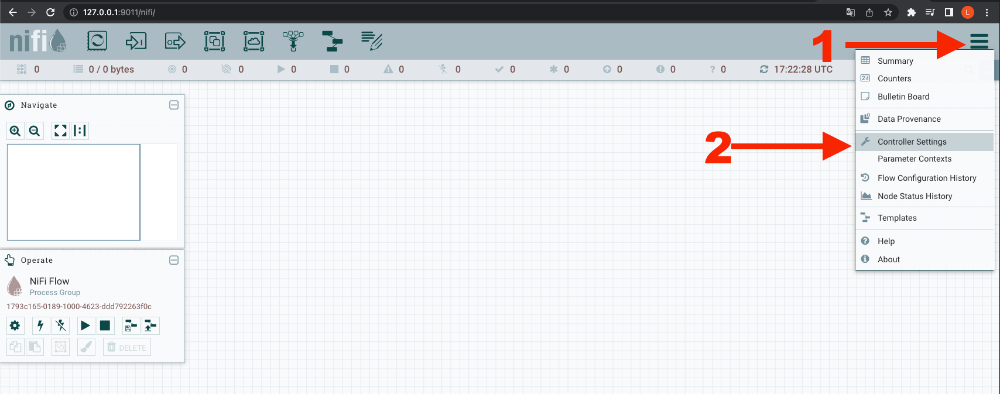
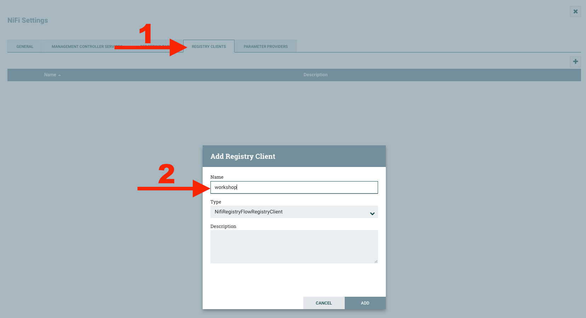
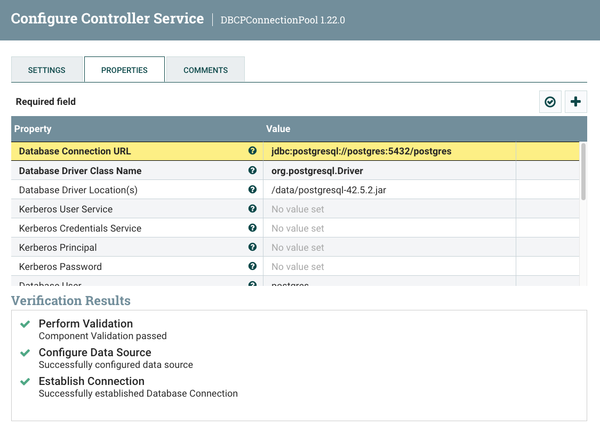

**ws-modern-pipelines-nifi**


#Criando Pipeline de Dados Moderno com Apache Nifi na Prática

<div style="display: inline_block"><br>
  
</div>


**Requisitos**
- 2 CPUs or more
- 2GB of free memory
- 20GB of free disk space
- Internet connection
- Container ou virtual machine: Docker, QEMU, Hyperkit, Hyper-V, KVM, Parallels, Podman, VirtualBox, ou VMware Fusion/Workstation


# Como executar o Projeto
Escolha instalar no Docker ou Minikube


**1- Clonar repositório**
```bash
xxxxxxxxxxxxxxxxx
````

**2- Instalar Docker**

https://docs.docker.com/desktop

**3- Iniciar os serviços**
```bash
#(.../ws-modern-pipelines-nifi/docker)
docker-compose up -d
````
# Ou 

**2- Instalar Minikube**

https://minikube.sigs.k8s.io/docs/start/

**3- Iniciar os serviços**
```bash
# Iniciar Cluster
minikube start

# Criar novo namespace
kubectl create namespace nifi

# Criar os pods
kubectl apply -f deployment/workshop.yml 

# Verificar se os pods estão com status running
kubectl get pods -n nifi

# Iniciar os serviços 
minikube tunnel
````
#
**4- Acessar o Nifi:**

http://127.0.0.1:8080/nifi
#
**5- Acessar o Nifi-Registry:**

http://127.0.0.1:18080/nifi-registry
#
**6- Configurar o Nifi-Registry**

- Clique no menu de ferramentas.


#
- Clique em Novo Bucket e adicione um nome.


#
- Abra o Nifi >> Menu Sandwich >> Controller Settings


#
- Na guia Registry Clients, adicione um nome para o registry


#
- Edite as propriedades do novo registry com os parâmetros abaixo.

- http://nifi-registry:18080/
- Clique Update


#

7- Configurar a conexãom com Postgres

- jdbc:postgresql://postgres:5432/postgres
- org.postgresql.Driver
- /opt/jdbc/postgresql-42.5.2.jar
- usr: postgres
- pws: postgres123




<div style="display: inline_block"><br>


                    
</div>
  
  ##
<div> 
  <a href="https://www.youtube.com/@engenhariadedadosacademy" target="_blank"></a>
  <a href="https://www.instagram.com/engenhariadedados/" target="_blank"></a>
  <a href = "mailto:leonardo.souza@owshq.com"></a>
  <a href="https://www.linkedin.com/in/leonardo-c%C3%B4co-9863712a/" target="_blank"></a> 
  
</div>


CREATE TABLE device (
    id INTEGER,
    uid UUID,
    build_number INTEGER,
    manufacturer VARCHAR(255),
    model VARCHAR(255),
    platform VARCHAR(255),
    serial_number VARCHAR(255),
    version INTEGER,
    user_id INTEGER,
    dt_current_timestamp BIGINT
);


